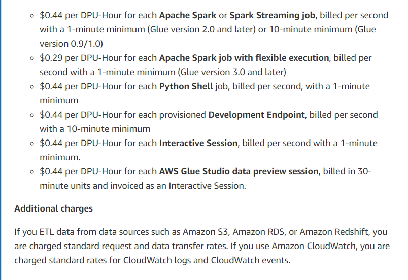

## How much does AWS Glue cost (Q3/2023 Update)
##### [AWS Glue Pricing Reference Link](https://aws.amazon.com/glue/pricing/)
##### [AWS Glue Pricing Calculator](https://calculator.aws/#/createCalculator/Glue)

### AWS Glue ETL jobs and interactive sessions
With AWS Glue, there are no upfront fees or costs for maintaining infrastructure andd no charges for starting up or shutting down. Users only pay for what they use, which means charges are only applied to job runs. The cost is based on an hourly rate that is rounded to the nearest second, calcualted based on the number of DPUs used to run your ETL job. AWS Glue offers different worker types with varying capacities, including:
- Standard
- G.1X
- G.2X
- G.025X

{}
One DPU is equivalent to 4 vCPUs and 16 GB of memory
{}

Users can use AWS Glue interactive sessions for interactive ETL code development, but they only incur charges if they decide to run some transformations as a job. The duration of the session determines the cost of interactive sessions and the amount of DPUs used. Interactive sessions can be set with adjustable idle timeouts, and are billed a minimum of 1 minutes. 

{}
Interactive sessions require a minimum of 2 DPUs, with a default of 5 DPUs.
{}

AWS Glue Studio allows data previews to test your transformations during the job authoring process. 

{}
Each AWS Glue Studio data preview session uses 2 DPUs, runs for **30 minutes**, and **stops automatically**.
{}
Below is the Singpore Region pricing example:

### Data catalog and storage requests
With Data Catalog, you have a free tier to store a certain number of metadata objects such as tables, table versions, partitions, and databases. If you exceed this limit, you will incur charges based on the number of additional objects you store over the free tier. 

The pricing is applied on a per-object basis and is based on the number of objects exceeding the free-tier limit. 

{}
The charges apply only to the Data Catalog and not to any other AWS services that you may use with it
{}

### AWS Glue crawlers
AWS Glue crawlers incur an hourly charge for discovering data and updating the Data Catalog based on the number of DPUs used. 
{}
The crawler is billed in 1-second increments, with a minimum of 10 minutes for each crawl, and rounded up to the nearest second. 
{}
Using AWS Glue crawlers optional, and users can populate the Data Catalog directly through the API

### DataBrew interactive sessions
Databrew charges users for authoring on a **per-session** basis. A session is initiated when a DataBrew project is opened and users are billed for the total number of sessions used. Each session can last for 30 moinutes and is billed in 30-minuted increments. 

{}
First-time users of DataBrew are offered the first 40 interactive sessions for free
{}

### DataBrew jobs
Users are charged an hourly rate based on the number of DataBrew workers used to run the job.

{}
By default, DataBrew allocates five workers to each job. There is a 1-minute billing duration for each job.
{}

### AWS Glue Flex execution
AWS Glue has introduced a new option that can help customers reduce the costs of their pre-production testing, and non-critical data integration workloads by as much as 34 percent. This option is known as AWS Glue Flex execution, which utilizes spare capacity in AWS to run AWS Glue jobs.

### AWS Glue Data Quality
With AWS Glue Data Quality, users can standardize their data by comparing it with the source system and preserving the approved data for downstream use. AWS Glue automatically generates rule recommendations based on computed statistics of the data and uses these statistics to verify its accuracy. Additionally, custom rules can be created by writing logic using the straightforward Data Quality definition langauge.

### AWS Glue Schema Registry
A schema defines the structure and format of a data record. With AWS Glue Schema Registry, you can manage and enforce schemas on your data streaming applications using convenient integrations. These integrations include Apache Kafka, Amazon Managed Streaming for Apache Kafka, Amazon Kinesis Data Streams, Amazon Kinesis Data Analytics for Apache Flink, and AWS Lambda.

